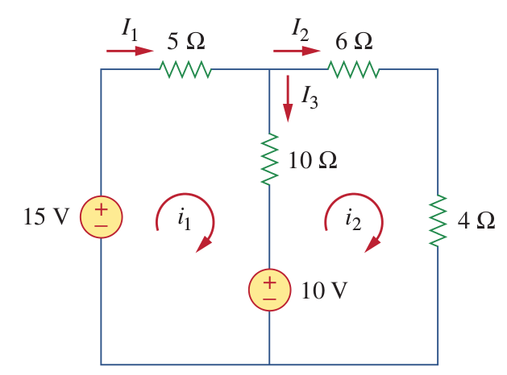
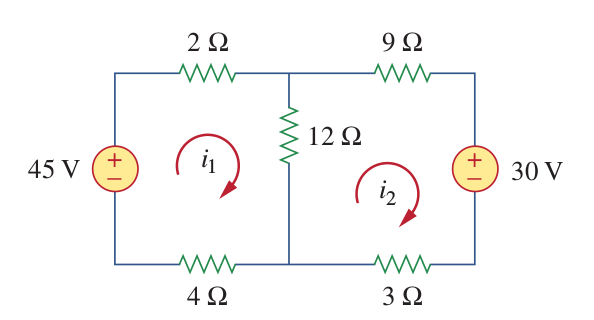
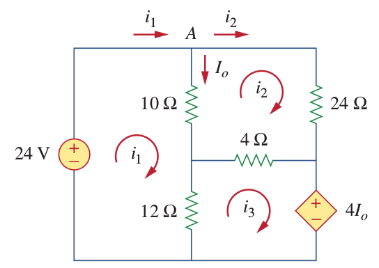
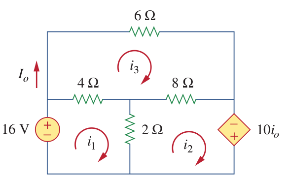

# Mesh Analysis

In the Mesh analysis the unknown parameters are mesh currents instead of the node voltages.

**A mesh is a loop which does not contain any other loops within it.**

In the Nodal analysis we have used Kirchhoff's Current Law, in the Mesh Analysis Kirchoof's Voltage Law will be used.

|  | Nodal Analysis | Mesh Analysis |
| -- | -- | -- |
| **Unknowns** | Node Voltages | Mesh Current |
| **Method** | Kirchoof's Current Law | Kirchoof's Voltage Law |
| **Supernode/ Supermesh**| Voltage Sources|Current Sources|

Mesh analysis can only be applied to planar circuit. A planar circuit can be drawn with no branches crossing one another.

Method includes the following steps:
- Label each mesh in the circuit.
- Write KVL equations for each mesh.
- Solve equations for the mesh currents.

Things to be careful:
- Although, the direction of mesh currents (clockwise or counterclockwise) is arbitrary, and the equations are valid for both directions, it is conventional to use clockwise current direction.
- Use - sign if you encounter the negative polarity of the voltage source first, use + sign otherwise.

### Example 1:
Find the branch currents.

Write the KVL equations for each mesh:

Mesh1:
$$-15 + 5i_1 + 10 (i_1 - i_2) + 10 =0$$
$$15i_1 - 10 i_2 = 5$$
which is equal to:
$$3i_1 - 2i_2 =1$$

Mesh2:
$$6i_2 + 4i_2 -10 + 10 (i_2 - i_1) =0$$
$$2i_2-i_1=1$$

Using the substitution method:
$$i_1 = 2i_2 -1$$
$$i_1 = 1 A \quad i_2 = 1 A$$

The branch currents are:
$$I_1 = i_1$$
$$I_2 = i_2$$
$$I_3 = i_1-i_2$$
Thus:
$$I_1 = 1 A$$
$$I_2 = 1 A$$
$$I_3 = 0$$

### Example 2:
Find the branch currents

Mesh1:
$$-45 + 2i_1 + 12 (i_1 - i_2) + 4i_1 = 0$$
$$6i_1-4i_2=15$$

Mesh2:
$$12(i_2-i_1)+9i_2 +30 + 3i_2 =0$$
$$4i_2 - 2i_1 = -5$$

$$i_1 = 2.5 A, i2=0 A$$

### Example 3:
Use mesh analysis to find Io.

Write KVL equation for each mesh:

Mesh 1:
$$-24 + 10(i_1 - i_2) + 12 (i_1 - i_3) =0$$
$$11i_1 - 5i_2-6i_3 = 12$$

Mesh 2:
$$24i_2 + 4(i_2-i_3) + 10(i_2 -i_1)=0$$
$$-5i_1 + 19i_2 - 2i_3 = 0 $$

Mesh3:
$$12(i_3-i_1) + 4 (i_3 -i_2) + 4I_o =0$$
Io equals to:
$$I_o = i_1 - i_2$$
Thus:
$$12(i_3-i_1) + 4 (i_3 -i_2) + 4(i_1-i_2) = 0 $$
which is equal to:
$$-8i_1-8i_2+16i_3 =0$$
$$-i_1-i_2+2i_3 =0$$
Thus:
$$i_1 = 2.25 A \quad i_2 = 0.75 A \quad i_3 = 1.5 A$$

We need to find Io, which is equal to:
$$I_o = i_1 -i_2 = 1.5 A$$

Try to solve the same problem with node voltage analysis.

### Example 4:
Use mesh analysis to find Io.

Mesh 1:
$$-16+4(i_1-i_3)+2(i_1-i_2)=0$$
$$6i_1 - 2 i_2 - 4i_3 =16$$
$$3i_1 - i_2 - 2i_3 = 8$$

Mesh 2:
$$2(i_2 - i_1) + 8(i_2-i_3) -10 I_o =0$$
$$I_o = i_3$$
$$10i_2 -2i_1 - 8i_3 -10i_3 =0$$
$$-i_1+5i_2-9i_3=0$$

Mesh 3:
$$6i_3 + 8(i_3-i_2) + 4(i_3-i_1) =0$$
$$18i_3-8i_2-4i_1=0$$
$$-2i_1-4i_2+9i_3=0$$

$$\begin{bmatrix} 3 & -1 & -2 \\ -1 & 5 & -9 \\
-2 & -4 & 9
\end{bmatrix}
\begin{bmatrix}
i_1 \\
i_2 \\
i_3 \\
\end{bmatrix}
=
\begin{bmatrix}
8\\
0 \\
0 \\
\end{bmatrix}
$$

$$
\begin{bmatrix}
i_1 \\
i_2 \\
i_3 \\
\end{bmatrix}
=
\begin{bmatrix}
-2.57\\
-7.71 \\
-4 \\
\end{bmatrix}
$$

$$I_o = i_3 = -4 A$$

