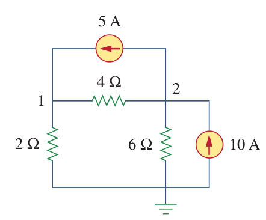
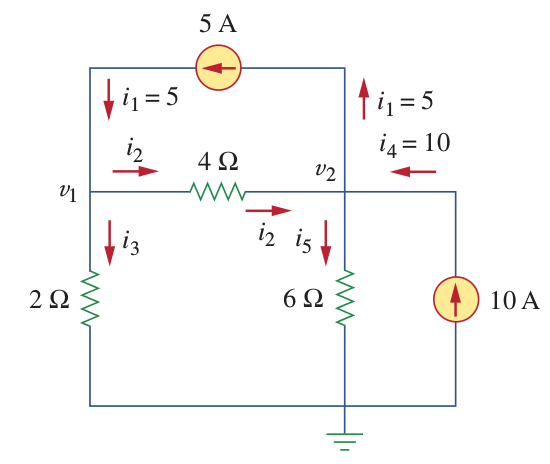
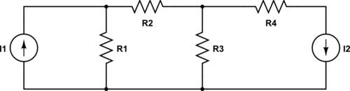
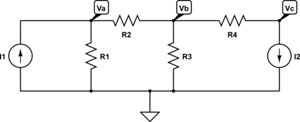

# Nodal Analysis

In the nodal analysis, node voltages are calculated by solving the Kirchhoff's Current Law (KCL) equations obtained from each node.

Method includes the following steps:
- Choose a reference node (ground)
- Assign node voltages
- Write KCL equations for each node except the ground node.

(For reference check [Nodal Analysis e-book](http://www.solved-problems.com/download/NodalAnalysis.pdf)).

#### 1-Choose a reference node (or ground node)
- It is best to choose ground node as the node interconnects the most branches.
- The ground node is usually at the bottom of circuit.
- Label ground with one of the symbols below:

#### 2-Assign node voltages
Give label to each node except the reference node.

#### 3- Write KCL equations
- write KCL equations (the most practical way is to use negative sign for the currents entering to the node), positive sign for currents exiting from the node).
- After defining KCL for each node, the equations can be put in matrix form and the problem can be solved.

#### 4-Solve
Methods for solving system of linear equations:
- [Elimination Method](http://www.mathplanet.com/education/algebra-1/systems-of-linear-equations-and-inequalities/the-elimination-method-for-solving-linear-systems) : Simplest but not really scalable to more complex equations
- [Row reduction](http://www.mathportal.org/algebra/solving-system-of-linear-equations/row-reduction-method.php): A systematical way of elimination, can be applied to more complex cases, but it's time consuming.
- [Cramer's Rule](http://en.wikipedia.org/wiki/Cramer%27s_rule) ([example](http://www.youtube.com/watch?v=taBHTo8sviM)): Practical for up to 3x3 matrices.
- [Inverse Matrix Method](http://www.mathportal.org/algebra/solving-system-of-linear-equations/inverse-matrix-method.php): Scalable to even the most complex cases, but you'll need a calculator or computer.

### Example 1:
Calculate the node voltages for the following circuit[^1]:

[^1]: Alexander&Sadiku, 2012, pg84.

Answer:
V1= 40/3 V, V2= 20 V

## Matrix Equations
### Example:
Apply the nodal analysis in the following circuit:
This is some text.

- Define the bottom node as the reference node
- Apply KCL for each node:

**Node a:**
$$-I_1 + \frac{V_a}{R_1} + \frac{V_a-V_b}{R_2} = 0 $$

**Node b:**
$$\frac{V_b-V_a}{R_2} + \frac{V_b}{R_3} + \frac{V_b-V_c}{R_4} = 0 $$

**Node c:**
$$ \frac{V_c-V_b}{R_4} + I_2 = 0 $$

Then everything can be put into matrix form:

$$\begin{bmatrix} \frac{1}{R_1}+\frac{1}{R_2} & -\frac{1}{R_2} & 0 \\ -\frac{1}{R_2} & \frac{1}{R_2}+ \frac{1}{R_3}+\frac{1}{R_4} & -\frac{1}{R_4} \\
0 & -\frac{1}{R_4}  & \frac{1}{R_4} \end{bmatrix}
\begin{bmatrix}
V_a \\
V_b \\
V_c \\
\end{bmatrix}
+
\begin{bmatrix}
-I_1 \\
0 \\
I_2 \\
\end{bmatrix}
=0$$

which is equivalent to
$$\begin{bmatrix} \frac{1}{R_1}+\frac{1}{R_2} & -\frac{1}{R_2} & 0 \\ -\frac{1}{R_2} & \frac{1}{R_2}+ \frac{1}{R_3}+\frac{1}{R_4} & -\frac{1}{R_4} \\
0 & -\frac{1}{R_4}  & \frac{1}{R_4} \end{bmatrix}
\begin{bmatrix}
V_a \\
V_b \\
V_c \\
\end{bmatrix}
=
\begin{bmatrix}
I_1 \\
0 \\
-I_2 \\
\end{bmatrix}
$$

For convenience instead of resistance, conductance can also be used:

$$G = \frac{1}{R}$$

Thus, the equation becomes:

$$\begin{bmatrix} G_1+G_2 & -G_2 & 0 \\ -G_2 & G_2+ G_3+G_4 & -G_4 \\
0 & -G_4  & G_4 \end{bmatrix}
\begin{bmatrix}
V_a \\
V_b \\
V_c \\
\end{bmatrix}
=
\begin{bmatrix}
I_1 \\
0 \\
-I_2 \\
\end{bmatrix}
$$

Note that, this is a classic matrix equation:
$$AX = B$$
This equation can be solved as:
$$X = A^{-1}B$$

where \\(A^{-1}\\) is the inverse of matrix A. In order to get the inverse of a matrix it has to be a square matrix. Furthermore, due to KCL applied A matrix in an electric circuit will be symmetrical.

