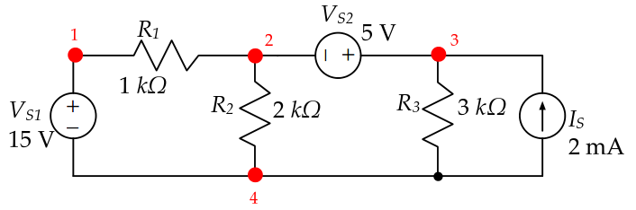
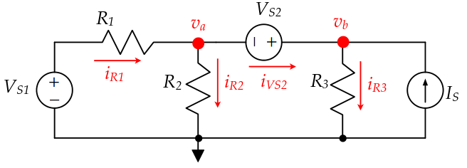
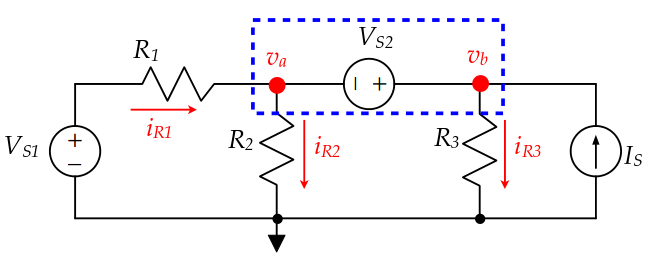

# Supernodes
Although, node voltage analysis will always work, there are some tricks to make it easier. For example, whenever there is a voltge source, the followign technique can be applied to reduce the number of unknowns.

### Node Analysis with Voltage Sources

Consider the following circuit:

There are four nodes in the circuit. We should select one as the ground node. Node#4 connects four branches, thus it is the most suitable as a reference node.

The voltage of node 1 is also known, so we can solve the circuit for two unknowns.

Let's write KCL equations for node A:

$$\frac{V_a-V_{s1} }{R_1} + \frac{V_a}{R_2} + I_{VS2} = 0$$

which is equal to:

$$\frac{V_a-15 }{1k\Omega} + \frac{V_a}{2k\Omega} + I_{VS2} = 0$$

For Node B:
$$- I_{VS2} +\frac{V_b }{R_3} - I_{S} = 0$$
which is equal to:
$$- I_{VS2} +\frac{V_b }{3k\Omega} - 2mA = 0$$

We can write another equation to define \\(V_{S2}\\)

$$V_a + V_{S2}= V_b$$

It is ok to apply the nodal analysis method like this, but there is an easier way, which helps to reduce the number of unknowns.

As the KCL can be applied to any closed loop. We can define a loop as shown in the figure.

Now, we can write a single equation by directly applying the relation between \\(V_a\\) and \\(V_b\\)

$$\frac{V_a-V_{s1} }{R_1} + \frac{V_a}{R_2} + \frac{V_a+V_{S2}}{R_3}-  I_{S} = 0$$

which is equal to:
$$\frac{V_a-15}{1k\Omega} + \frac{V_a}{2k\Omega} + \frac{V_a+5}{3k\Omega}-  2mA = 0$$

Here, it is much easier since we have only one unknown:

$$V_a = 8.36 V$$
$$V_b = V_a + 5 = 13.36 V$$
