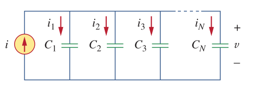
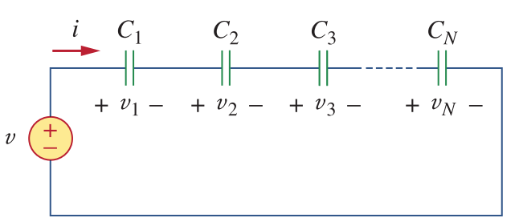

# Capacitors

A capacitor is a device that consists of two conducting plates seperated by an insulator layer.

Capacitance is the ratio of electric charge to voltage. The unit of capacitance is Farads (F)

#### \\(C = \frac{Q}{V}\\)

Capacitance can also be calculated using the material properties.

#### \\(C = \frac{\varepsilon A}{d}\\)
where \\(\varepsilon\\) is the permitivity of the dielectric material, \\(A\\) is the surface area and \\(d\\) is the distance between conducting layers.

The relation between the current and voltage of a capacitor is:

#### \\(i = C\frac{dV}{dt}\\)

or it can be written in integral form as:

#### \\(V = \frac{1}{C} \int_0^t i(t) dt\\)

Energy stored in a capacitor is:

#### \\(w = \frac{1}{2} C V^2\\)

####DC Response
From the equation below:
#### \\(i = C\frac{dV}{dt}\\)
following things can be concluded.

- Current of capacitor is zero if there's no change in the voltage (i.e. DC voltage)
- Capacitor voltage cannot be change instantenously as this means infinite current.

### Capacitor Connections

#### Parallel Connection

Parallely connected N capacitors are shown in the figure below:

Equivalent capacitance of the capacitors are the sum of the capacitors.

\\(C_{eq} = C_1 + C_2 + C_3 ... C_N\\)

#### Series Connection

Series connected N capacitors are shown in the figure below:

Equivalent capacitance of series connected capacitors are:
#### \\(\frac{1}{C\_{eq}} = \frac{1}{C_1} + \frac{1}{C_2} + \frac{1}{C_3} ... \frac{1}{C_N}\\)

For two capacitors connected in series, equivalent capacitance is:

#### \\(C_{eq} = \frac{C_1 C_2}{C_1 + C_2}\\)
