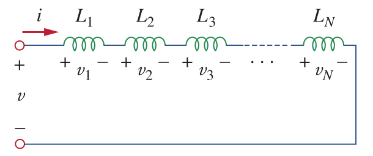
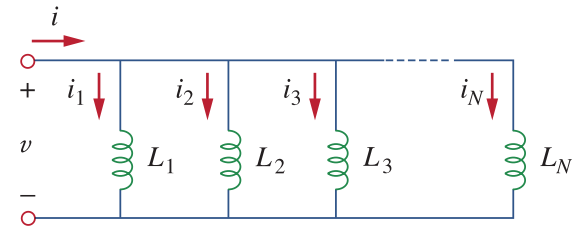

# Inductors

A typical inductor is given in the figure below:

The voltage and current relation of an inductor is:

\\(V = L \frac{di}{dt}\\)

or in integral form:

#### \\(I = \frac{1}{L} \int_0^t V(t) dt\\)

An inductor opposes to the change of current. The unit of inductance is Henry (H).

The inductance of an inductor can be written as:

#### \\(L = \frac{N^2 \mu A}{l}\\)

where \\(N\\) is the number of turns, \\(\mu\\) is the permeability of the core, \\(A\\) is the cross-section area, \\(l\\) is the mean length of the magnetic flux.

Energy stored in an inductor is:

#### \\(w = \frac{1}{2} L I^2\\)

####DC Response
- An inductor behaves like short-circuit under DC
- Inductor current cannot be change instantenously as this means infinite voltage.

### Inductor Connections

#### Series Connection

Equivalent inductance of series connected inductors are the sum of inductances:

#### \\(L_{eq} = L_1 + L_2 + L_3 ... L_N\\)

#### Parallel Connection

Parallely connected N inductors are shown in the figure below:

Equivalent inductance in parallel connection is:

#### \\(\frac{1}{L\_{eq}} = \frac{1}{L_1} + \frac{1}{L_2} + \frac{1}{L_3} ... \frac{1}{L_N}\\)

