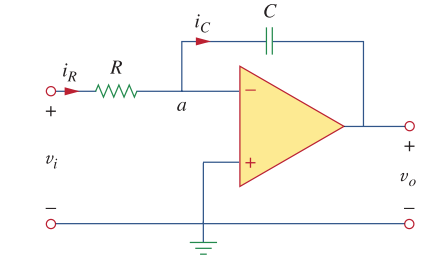
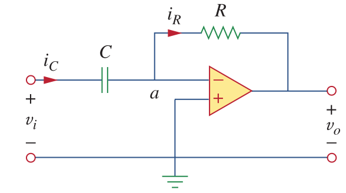

# Opamp Applications

Opamp applications with capacitors:

##Integrator

\\(i_R = i_C\\)

\\(i_R = V_i/R\\)

\\(i_C = -C d v_o /dt\\)

\\(dv_o = -\frac{1}{RC}v_idt\\)

Integrating both sides:

\\(v_o = -\frac{1}{RC} \int_0^tv_i(t) dt\\)

## Differentiator

\\(i_R = i_C\\)

\\(i_R = - V_o/R\\)

\\(i_C = -C d v_i /dt\\)

\\(v_o = -RC dv_i(t)/dt\\)
