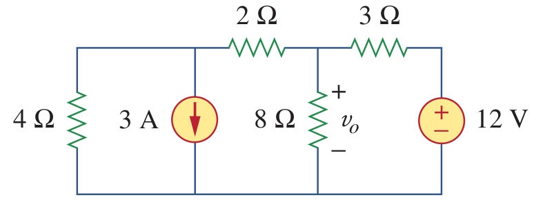
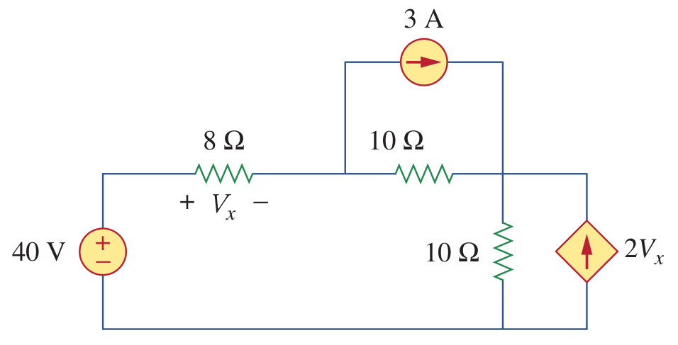
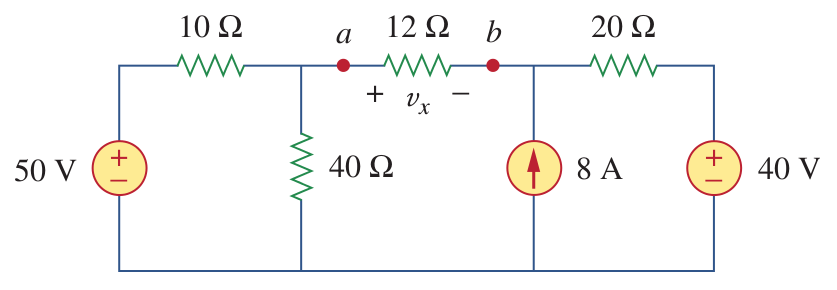

# Source Transformation

It is possible to convert voltage sources to current sources (or vice versa) if they have the same V-I characteristics.

Plot the V-I characteristics for the following two circuits:

Thus, the two circuits are equal if they satisfies the following condition:

$$I_s = V_s /R $$

$$V_s = I_s R$$

#### Transformation from Voltage Source to Current Source

#### Transformation from Current Source to Voltage Source

#### Examples
####Ex1

#### Ex2

#### Ex3

