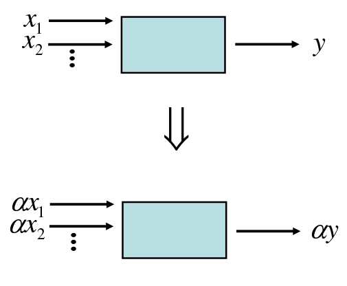
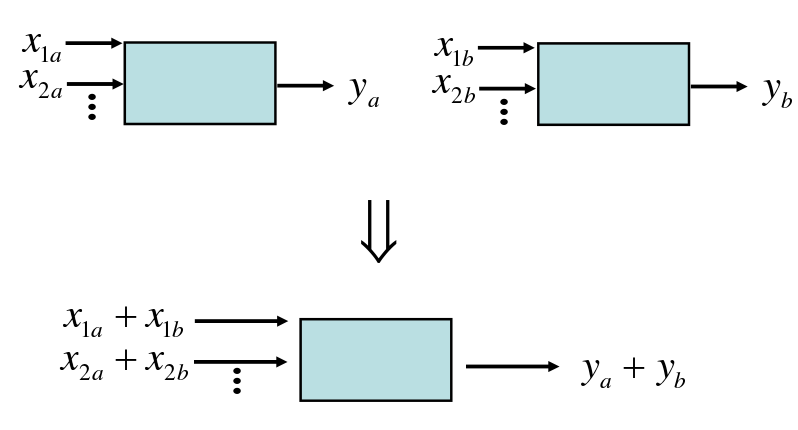
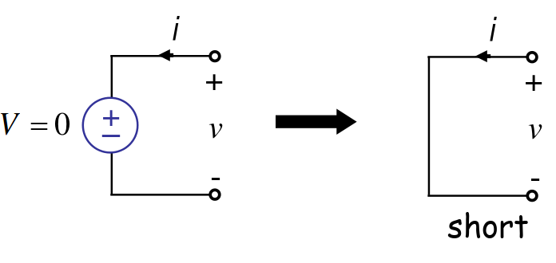
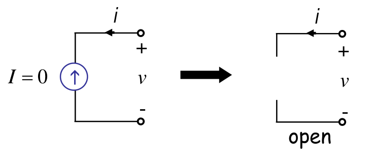

# Superposition & Homogeneity

A circuit is called linear if it satisfies the following two conditions:
- #### Superposition (Additive) Property:
#### $$f(a + b) = f(a) + f(b)$$
- #### Homogeneity (Scaling) Property:
#### $$f(ka) = k f(a) $$

Superposition is not limited to circuit analysis but is applicable in many fields where cause and effect bear a linear relationship to one another.

### Superposition as an Analysis Method

Using the superposition property of linear circuits. The voltages and currents can be considered as the algebraic sum of all independent sources that they create independently.

#### Steps for Superposition Method:

- Turn off all independent sources except one.
- Calculate the voltage or current in the relevant points.
- Repeat the same process one  by one for each independent sources.
- Sum all results to find out the resultant voltage or currents.

**!! How to turn of sources:**

- **Voltage Source:** V=0 means short circuit
- **Current Source:** I=0 means open circuit

### Examples:

