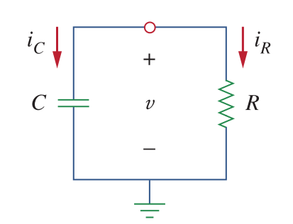
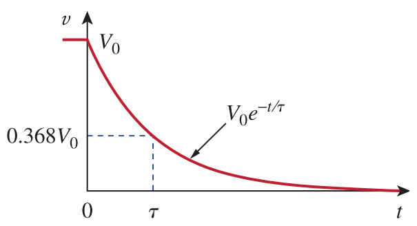
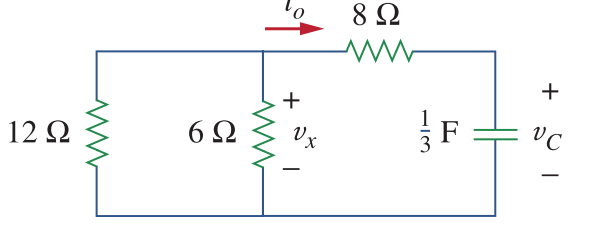

# RC Circuits

# First-Order Circuits

Consider a circuit with resistor and capacitor as shown below.

At t=0, the capacitor voltage is \\(V_o\\). Applying KCL at the node:

\\(i_c + i_R = 0\\)

\\(C \dfrac{dv}{dt} + \dfrac{v}{R} = 0\\)

\\(\dfrac{dv}{dt} = - \dfrac{v}{RC} \\)

which is a first order differential equation.

\\(\dfrac{dv}{v} = - \dfrac{1}{RC}dt\\)

Integrating both sides:

\\( ln (v) = -\dfrac{t}{RC} + ln (A)\\)

or:

\\( ln (\dfrac{v}{A}) = -\dfrac{t}{RC}\\)

taking exponential power on each sides:

\\( v(t) = Ae^{-\dfrac{t}{RC}}\\)

As we know the initial voltage is \\(V_0\\). Thus:

\\( v(t) = V_oe^{-\dfrac{t}{RC}}\\)

Thus, the voltage response of a RC circuit is an exponential decay of voltage.
The time constant of the circuit is given as:

\\(\tau=RC\\)

The unit of the time constant is in seconds.

Thus, the equation above becomes:

\\( v(t) = V_oe^{-\dfrac{t}{\tau}}\\)

, which is presented in the figure below:

    

#### Exercise:

If the initial voltage of the capacitor is 60 V, then determine Vc, Vx, io.

60, 20, -5
