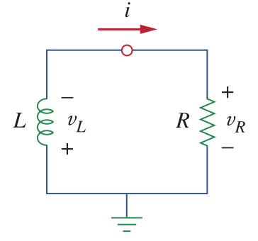

# RL Circuit

Consider a RL circuit as shown below , with the initial current of \\(I_0\\)

Similar to analysis of RC circuit, but this time applying KVL around the loop.

\\(v_L + v_R = 0\\)

\\(L \dfrac{di}{dt} + Ri =0\\)

\\(i(t) = I_o e^{-\dfrac{Rt}{L}}\\)

Thus, the time constant can be defined as:

\\(\tau = \dfrac{L}{R}\\)

The unit of the time constant is in seconds.

The current of the inductor can be represented as:

\\(i(t) = I_0 e ^{-\dfrac{Rt}{L}}\\)
