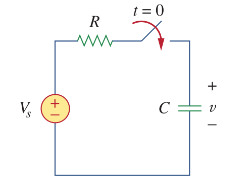

# Step Response

## Step Response of RC Circuits

What happens if we excite an RC circuit with Vs at t=0?

when t=0

\\(i_c = V_s/R\\)

for t>0

\\(i_c = (V_s-V_c)/R\\)

\\(i_c = C \dfrac{dV_c}{dt}\\)

Then;

\\(C \dfrac{dV_c}{dt} = (V_s-V_c)/R\\)

which can be represented as:

\\(\dfrac{dV_c}{dt} = \dfrac{V_s-V_c}{RC}\\)

\\(\dfrac{dV_c}{V_c-V_s} = -\dfrac{dt}{RC}\\)

integrating both sides and taking exponentials:

\\(V_c(t)=V_s + (V_o - V_s)e^{-t/RC}\\)

where \\(V_0\\) is the initial voltage of the capacitor.

If the initial voltage of the capacitor is zero then:

\\(V_c(t)=V_s (1-e^{-t/RC})\\)

