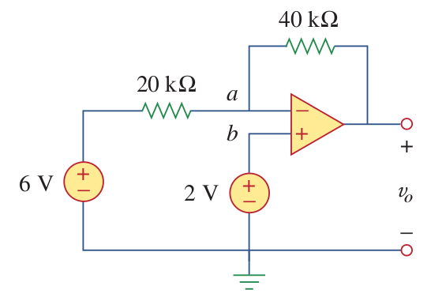

# OPAMPs

Typical Values

|  | Typical Values| Ideal Values |
| -- | -- | -- |
| A (Open-loop gain) | \\(10^5-10^8\; \Omega\\) | \\(\infty\\) |
| Rin (Input Resistance) | \\(10^5-10^{13}\; \Omega\\) | \\(\infty\\) |
| Rout (Output Resistance) | \\(10-100\; \Omega\\) | \\(0\\) |

####Example:
Find vo in the circuit.

