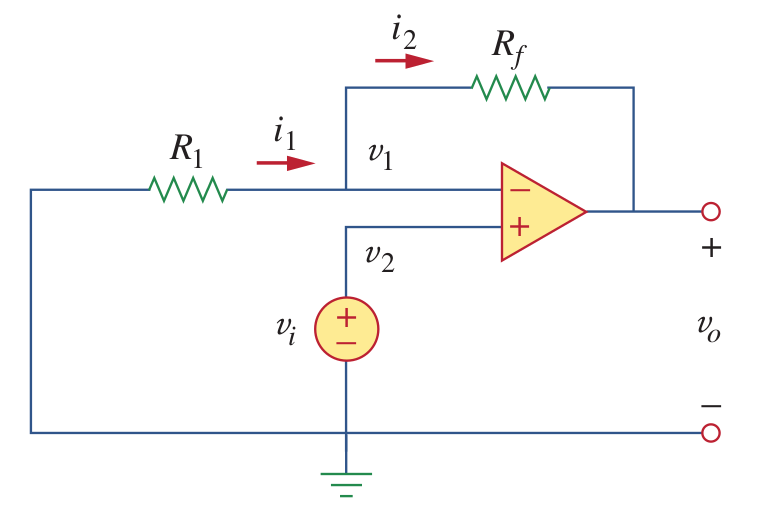
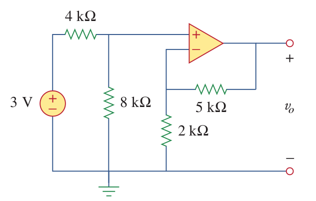
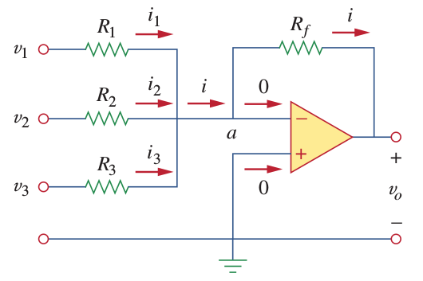
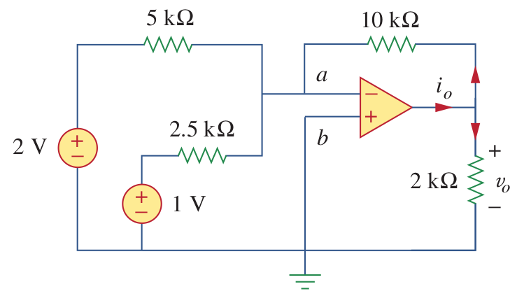
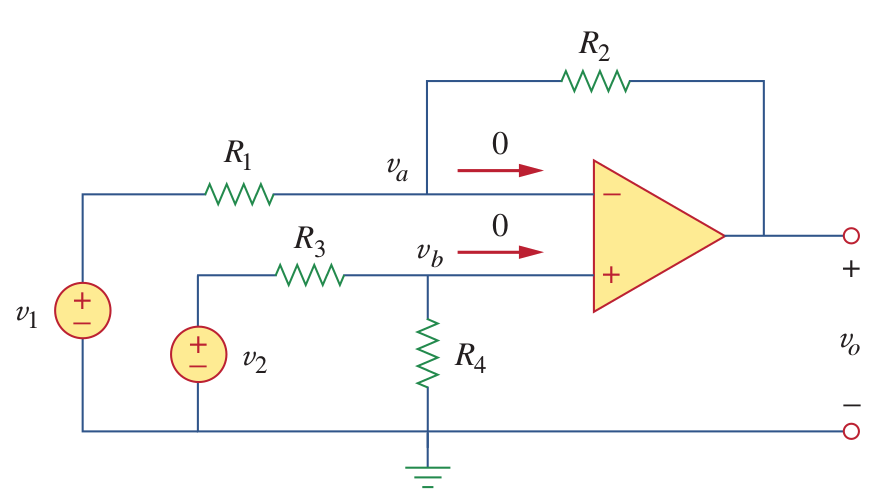
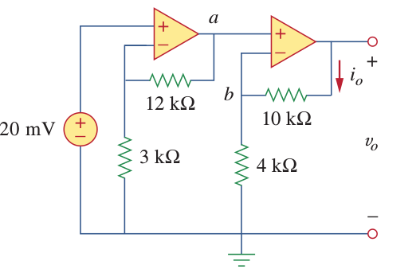
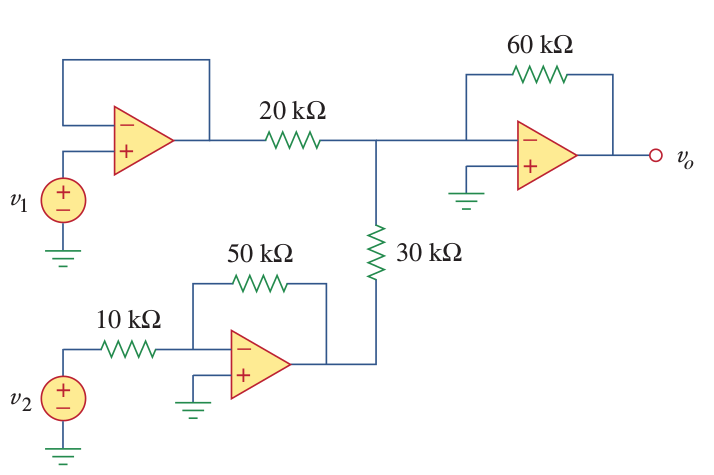

# OPAMPs

Typical Values

|  | Typical Values| Ideal Values |
| -- | -- | -- |
| A (Open-loop gain) | \\(10^5-10^8\; \Omega\\) | \\(\infty\\) |
| Rin (Input Resistance) | \\(10^5-10^{13}\; \Omega\\) | \\(\infty\\) |
| Rout (Output Resistance) | \\(10-100\; \Omega\\) | \\(0\\) |

####Example:
Find vo in the circuit.

## Inverting Amplifier

## Non-inverting Amplifier

$$V_o = (1 + \frac{R_f}{R_1}) V_i$$

Ex:

Vo=7V

##Summing Amplifier

$$V_o = - R_f(\frac{V_1}{R_1} + \frac{V_2}{R_2} +  \frac{V_3}{R_3})$$

Ex:

Vo=-8V
io=-4.8mA

##Difference Amplifier

$$V_o = (\frac{R_2}{R_1} + 1)\frac{R_4}{R_3+R_4}V_2 - \frac{R_2}{R_1}V_1$$

Ex:
Design an op amp circuit with inputs v 1 and v 2 such that
Vo = 3V2 - 5V1

## Cascaded OPAMPS

V0=3.5 V
Ex:

V1=7V
V2=3.1 V

Vo=?
Vo=10V
