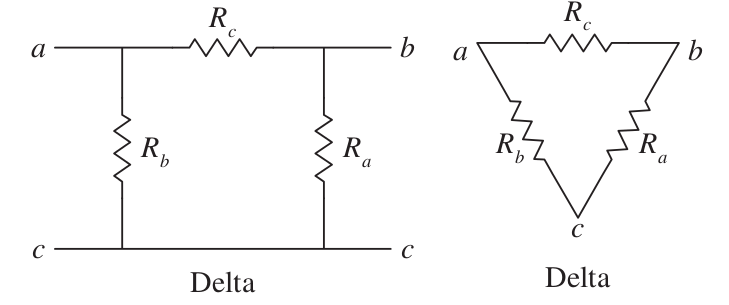
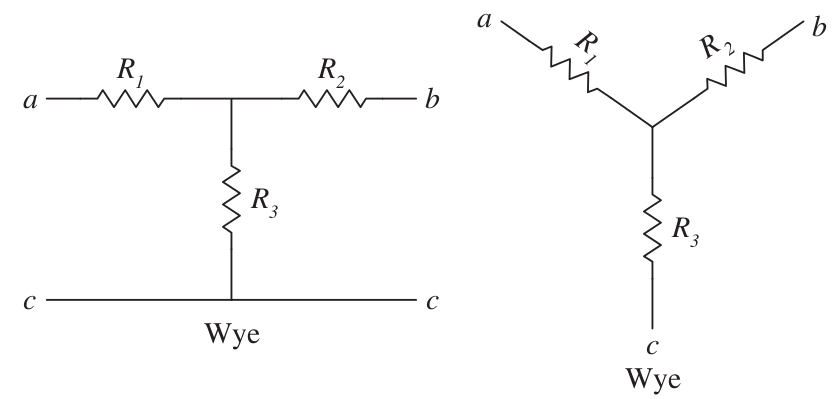
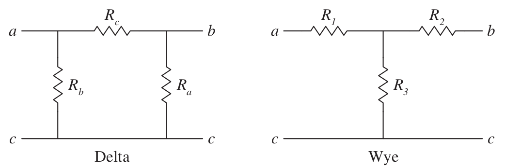

# Resistive Circuits

#Resistivity - Ohm's Law

The resistance of a material can be calculated as:

$$R = \rho \frac{\ell}{A} \quad \Omega $$

where \\(\rho\\) is the resistivity of the material, \\(\ell\\) is the length, \\(A\\) is the area. Remember to use SI units (m and m2) to get correect values.

Voltage across a resistor is proportional to current it is carrying.

$$Voltage = Current \times Resistance$$

$$V=IR$$

A **short circuit** is the case where the resistance between terminals is zero.

An **open circuit** is the case where the resistance between terminals is infinity.
#Series Resistors
The equivalent resistance of any number of resistors connected in series is the **sum of the individual resistances**.

$$R_{eq}=R_1+R_2+R_3 ... R_n$$

#Parallel Resitors
The equivalent resistance of two parallel resistors is equal to the product of their resistances divided by their sum.

$$R_{eq}=\frac{R_1 R_2}{R_1 + R_2}$$

#Delta-Wye Transformations

Instead of two terminal equivalents, three terminal equivalents are used.

## Delta Connections:
The following resistances are equal (Node C can be reduced to one point):

##Wye Connections:

## Transformation

#### Delta to Wye
$$R_1=\frac{R_bR_c}{R_a + R_b + R_c}$$

$$R_2=\frac{R_aR_c}{R_a + R_b + R_c}$$

$$R_3=\frac{R_aR_b}{R_a + R_b + R_c}$$

#### Wye to Delta
$$R_a = \frac{R_1R_2 + R_2R_3+R_3R_1}{R_1}$$

$$R_b = \frac{R_1R_2 + R_2R_3+R_3R_1}{R_2}$$

$$R_c = \frac{R_1R_2 + R_2R_3+R_3R_1}{R_3}$$

